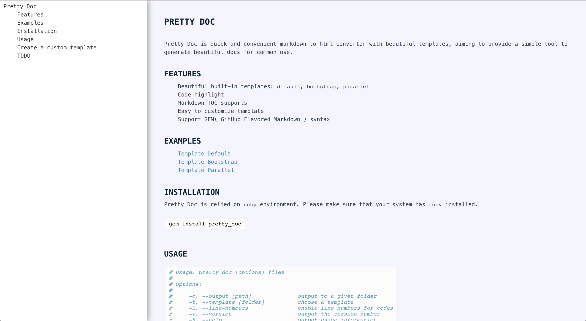

Pretty Doc
==========

Pretty Doc is quick and convenient markdown to html converter with beautiful templates, aiming to provide a simple tool to generate beautiful docs for common use.

[TOC]

## Features

+ Beautiful built-in templates: `default`, `bootstrap`, `parallel`
+ Code highlight
+ Markdown TOC supports
+ Easy to customize template
+ Support GFM( GitHub Flavored Markdown ) syntax

## Examples

+ [Template Default](https://lyfeyaj.github.io/pretty_doc/examples/default/README.html)
+ [Template Bootstrap](https://lyfeyaj.github.io/pretty_doc/examples/bootstrap/README.html)
+ [Template Parallel](https://lyfeyaj.github.io/pretty_doc/examples/parallel/README.html)



## Installation

Pretty Doc is relied on `ruby` environment. Please make sure that your system has `ruby` installed.

```bash
gem install pretty_doc
```

## Usage

``` bash
# Usage: pretty_doc [options] files
#
# Options:
#
#     -o, --output [path]              output to a given folder
#     -t, --template [folder]          choose a template
#     -l, --line-numbers               enable line numbers for codes
#     -v, --version                    output the version number
#     -h, --help                       output usage information
```

## Create a custom template

template structure

```
├── init.rb
├── style.scss
└── template.html.erb
```

## TODO

+ Add docs for how to create a custom template
